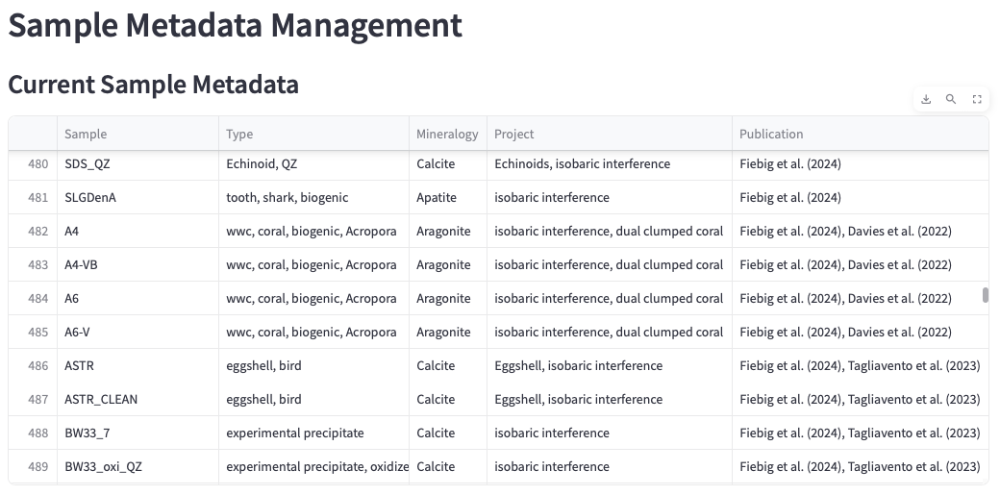

# Summary
Clumped isotope geochemistry is the study of small deviations between measured and expected relative abundances of multiply-substituted isotopologues.
Determination of ppm-ppb quantities of mass 47--49 isotopologues of CO${_2}$ is achieved through gas-source isotope-ratio mass spectrometers, and more recently became possible through laser spectroscopy, with resulting metrics being defined as $\Delta_{47}$--$\Delta_{49}$ values, respectively.
@Bernasconi_2021 demonstrated that $\Delta_{47}$ results became indistinguishable between 22 laboratories, if raw data were corrected using carbonate anchors and unique standardization parameters.
In their study, data were processed using the open-source Python library \href{https://github.com/mdaeron/D47crunch}{D47crunch} [@Daeron_2021], that considers standardization parameter optimization through least-squares regression and full error propagation, enabling straightforward and fast processing of multi-session datasets.

Here, we introduce \href{https://github.com/itsMig/D4Xgui}{D4Xgui}, a graphical user interface (GUI) tool that builds upon D47crunch.
It enables correction of mass spectrometric raw intensities for pressure baseline (PBL) bias induced by secondary electrons, before data is standardized using D47crunch.
Correcting mass-spectrometric raw intensity data for the contribution of a PBL is essential for most accurate determination of $\Delta_{i}$ values [@Bernecker_2023].
Metrics resulting from PBL correction and D47crunch-based standardization, alongside their corresponding statistics, can be explored on interactive plots and spreadsheets, all of which are downloadable.
Data processing inputs can be easily modified such that datasets that were processed beforehand can be rapidly re-processed using improved parameters.
A database can optionally be used to archive replicate data, and additional metadata uploaded in order to allow advanced filtering.

With D4Xgui, we provide a user-friendly, state-of-the-art app, whose operation does not require any prior knowledge of Python.
Beyond facilitating fast and most accurate determination of $\Delta_{47}$, $\Delta_{48}$ and $\Delta_{49}$ values of carbonate-derived CO$_2$, this app enables immediate inspection and visualization of data for purposes of quality assurance and data interpretation.

# Introduction
Carbonate clumped isotope thermometry enables determination of carbonate formation temperatures [@Ghosh_2006a] and allows to identify effects of isotopic disequilibrium [@Tripati2010] or secondary alteration [@Dennis2010; @Huntington_2011], among others.
Its application relies on thermodynamically driven fractionation of stable carbon and oxygen isotopes among different carbonate isotopologues, a phenomenon which favors increasing excess formation (relative to stochastically predicted isotope partitioning) of multiply heavy substituted isotopologues (*clumped isotopes*) with decreasing temperature [@Schauble_2006].
Since excess abundances of multiply substituted isotopologues cannot be analysed from within the carbonate directly, samples are quantitatively reacted with phosphoric acid and measurements are performed on the evolved CO$_2$.
Precise analysis of excess abundances of multiply substituted isotopologues was initially restricted to CO$_2$ of mass 47 (mainly made up of  $^{13}$C$^{18}$O$^{16}$O) and the corresponding metric defined as the $\Delta_{47}$ value.
Recent improvements in instrumentation also enabled highly precise quantification of excess abundances of mass 48 (mainly made up of  $^{12}$C$^{18}$O$^{18}$O) and 49 (exclusively made up of $^{13}$C$^{18}$O$^{18}$O) isotopologues [@Fiebig_2021; @Swart_2021; @Bernecker_2023].
Analysis of $\Delta_{48}$ alongside $\Delta_{47}$ values makes it possible to identify rate-limiting processes involved in carbonate (bio-)mineralization and to correct $\Delta_{47}$ values for these non-thermal biases, finally achieving accurate reconstruction of carbonate crystallization temperature [@Bajnai_2020; @Fiebig_2021].
Addition of $\Delta_{48}$ and $\Delta_{49}$ to the $\Delta_{47}$ toolkit can also help to identify isobaric interferences which follow compound-specific vectors in $\Delta_{47}$/$\Delta_{48}$- and $\Delta_{48}$/$\Delta_{49}$-space [@Fiebig_2024].

Gas-source isotope-ratio mass spectrometry represents a well-established technique for the analysis of relative abundances of CO$_2$ isotopologues of masses 44--49.
Carbonate-derived CO$_2$ is repeatedly measured against a working gas of known oxygen (expressed as $\delta^{18}$O) and carbon (expressed as $\delta^{13}$C) isotope compositions, and the isotopic composition of unknown sample CO$_2$ is expressed as $\delta^{45}$, $\delta^{46}$, $\delta^{47}$, $\delta^{48}$ and $\delta^{49}$ values relative to that of the working gas.
Precise and accurate determination of $\Delta_{47}$, $\Delta_{48}$ and $\Delta_{49}$ values requires enhanced counting statistics, achieved through multiple alternating replications of unknowns and standards.
State-of-the-art processing schemes for the determination of $\delta^{13}$C, $\delta^{18}$O, and $\Delta_{47}$-$\Delta_{49}$ values from mass spectrometric raw $\delta^{i}$ values generally consider corrections for i) isobaric contributions from $^{17}$O-bearing isotopologues [@Santrock_1985; @Daeron_2016; @Schauer2016], ii) compositional non-linearity [@Huntington_2009] and iii) scale compression [@Dennis_2011].
Compositional non-linearity can arise from secondary electrons which affect measured m/z$_{47}$--m/z$_{49}$ intensities.
These drive the baseline below m/z$_{47}$--m/z$_{49}$ to negative intensities, the extent of which depends on the pressure of CO$_2$ in the ion source [pressure baseline effect, PBL; @He_2012].
Compositional non-linearity is expressed by slopes ≠ zero in correlation plots of $\delta^{i}$ vs $\Delta_{i}$ values for CO$_2$ gases (or carbonates) of different bulk isotopic compositions, that were equilibrated at a given temperature.
This bias is driven by a mismatch of bulk isotopic compositions, when comparing the sample analyte with that of the working gas.
Since the negative PBL signal scales with the fixed-intensity m/z$_{44}$ beam and --over a short term-- the PBL signal doesn't change in magnitude, samples characterized by a more light $\delta^{i}$ composition compared to that of the working gas will have a negative $\Delta_{i}$ bias, and vice versa.
Recently developed software allows correction of mass spectrometric raw data for i), ii) and iii)~[e.g., @John_2016; @Daeron_2021], but lacks optimized scaling-factor-based correction of mass-spectrometric raw intensities utilizing a half-mass cup, which can introduce artificial bias on $\delta^{i}$ values, ultimately influencing final $\Delta_{i}$ values [@Fiebig_2016; @Bernecker_2023].
In addition, some processing schemes lack full error propagation [e.g., @John_2016]

Here, we introduce a data processing tool that allows most accurate determination of fully error-propagated $\Delta_{i}$ values of CO$_2$ extracted from carbonates.
In a first step, a PBL correction algorithm, that fully corrects for the secondary electron-induced bias in mass spectrometric raw $\delta^{i}$ and $\Delta_{i}$ values, through optimized scaling factors is added to the data processing scheme of @John_2016.
In a second step, PBL-corrected $\delta^{45}$-$\delta^{49}$ values are processed with D47crunch [@Daeron_2021], which allows determination of final and fully error-propagated $\Delta_{i}$ values.
Learning a programming language to apply state-of-the-art mathematical processing frameworks is a time-consuming task by itself.
With our D4Xgui app, we make a user-friendly data processing scheme available for the carbonate clumped isotope community.

# Methodology
## Data architecture and interfaces
![Flowchart illustrating the internal data architecture of D4Xgui. It is possible to upload eithe raw m/z$_{44-49}$ data or pre-processed $\delta^{45}$-$\delta^{49}$ data directly into D4Xgui. The (optional) baseline-correction algorithm is utilizing a half-mass cup signal; if this signal is not available, the user can directly calculate $\delta^{45}$-$\delta^{49}$ values from mass-spectrometric raw data. In order to simply use D47crunch, the user can directly upload pre-processed $\delta^{45}$-$\delta^{49}$ data. Uploaded or calculated $\delta^{45}$-$\delta^{49}$ data can (optionally) be stored in the `pre_replicates` table for later use. The session state may (optionally) be stored with an identifier in the `session_state` table, including uploaded data and processing results -- dependend on a user's current session. The (optional) `sample_metadata` table is utilized to apply post- or pre-processing filters, based on sample metadata.\label{fig:data_scheme}](figs/schemeData.pdf)

D4Xgui is equipped with multiple data input interfaces, a graphical overview can be found in \autoref{fig:data_scheme}.
Input data (mass-spectrometric m/z$_{44-49}$ data or pre-processed $\delta^{45}$-$\delta^{49}$) can be directly uploaded into D4Xgui using a file navigation context menu and via drag-and-drop functionality.
Internally, D4Xgui is backed by a self-contained, disk-based local SQLite database containing a table for pre-processed $\delta^{45}$-$\delta^{49}$ values (`pre_replicates` table).
In addition to this, a metadata database (`sample_metadata` table) is used to store metadata such as sample name, session, and other sample-specific information, all of which can be used for pre- and post-processing filtering.
All databases can be managed through the *Database Management* page (Figure~\ref{fig:db_meta}).
D4Xgui is designed to also allow processing without the use of any database functionality, provided that the necessary data is uploaded prior to processing.

### Internal data structure
No significant differences were obtained if data evaluation started from cycle or replicate level, for this reason D4Xgui will always calculate mean replicate values before adding data into the internal database.

**Database – pre_replicates table:**
The `pre_replicates` table is used to store pre-processed $\delta^{45}$-$\delta^{49}$ values together with information on `UID`, `Sample`, `Session` and `Timetag`.
These data can be derived from the upload, or from D4Xgui's internal calculation.

**Database – metadata table:**
Sample metadata is internally managed through the `sample_metadata` table, and can be provided in \*.xlsx format to make advanced filtering accessible in both, the *Data-I/O* page for pre-processing and, moreover, in pages dedicated for graphical representation of post-processing results.
Metadata can additionally be modified and new entries added to it via the *Database Management* page, *Sample Metadata* tab.
These filtering capabilities allow users to, for example, select a specific sample type, whereupon the app will provide all session data that includes archived samples of the chosen type, facilitating easy (re-)processing of multi-session datasets.
Metadata filters are based on `Sample`, `Session`, `Project`, `Publication`, `Type`, `Mineralogy` and `in charge` in the actual build.

**Database – D4Xgui session state:**
At any point, it is additionally possible to dump the entire session cache of D4Xgui into another self-contained database (`session_states`).
This functionality allows the user to store the session state at any point, and either continue processing at a later point, or to archive the results for future inspection.
To do so, the *Save&Reload* page can be utilized by saving the actual session state of the app together with a custom identifier.

### Upload options
Before uploading data directly to D4Xgui, it is necessary to format machine-generated raw data to ensure compatibility.
While some vendors for analytical setups provide automated \*.csv outputs, others store raw data in undocumented proprietary formats or require human interaction to produce exports.
Available tools for parsing raw data from binary files are e.g., isoreader [@isoreader] as a script-based option for R users, or Easotope [@John_2016] as multi-platform GUI tool for \*.did files, produced by IsoDat (Thermo Scientific, MAT253 or 253+).
Basic implementations of Python-based file parsers for \*.did-files (Thermo Scientific) and \*.csv-files (Nu Instruments) can be found within this project's repository (`tools/parse_isodat.py` and `tools/parse_nu-csv.py`, respectively), and might be utilized to extract raw intensity data.

**Upload option A – Uploading raw intensity data:**
Raw intensity data can either be uploaded in cycle, acquisition or replicate hierarchy.
In the current version, uploaded raw m/z intensities can only be corrected for a negative PBL (i.e., for the contribution of secondary electrons) if the gas-source mass spectrometer is equipped with an additional half-mass cup that continuously monitors the PBL intensity [e.g. at m/z$_{47.5}$, see @Fiebig_2019].
If no half-mass cup is available, we advise to employ a custom, baseline scan-based correction of raw intensities [e.g., @He_2012; @Bernasconi_2013; @Fiebig_2016].
Otherwise, data can also be processed without prior correction of raw intensities, ignoring potential bias in $\delta^{i}$ values, which ultimately increases uncertainty in final results [@Bernecker_2023].
The following features are required for each instance:
`UID`, `Sample`, `Session`, `Timetag`, `Replicate`, `raw_r44`, `raw_r45`, `raw_r46`, `raw_r47`, `raw_r48`, `raw_r49`, `(raw_r47.5)`, `raw_s44`, `raw_s45`, `raw_s46`, `raw_s47`, `raw_s48`, `raw_s49`, `(raw_s47.5)`

**Upload option B – Uploading pre-processed $\delta^{45}$-$\delta^{49}$ values:**
Replicate-level $\delta^{45}$-$\delta^{49}$ values, either PBL-corrected or not, can be uploaded.
Given that the D47crunch module is invoked for standardization, its relevant features must be uploaded per instance:
`UID`, `Sample`, `Session`, `Timetag`, `d45`, `d46`, `d47`, `d48`, `d49`

## Baseline correction and standardization
An overview of the processing pipeline for carbonate clumped isotope data is given in Figure~\ref{fig:processing_scheme}.

![Schematic overview of the processing steps involved in the process of calculating baseline-corrected, standardized and fully error-propagated clumped isotope values from mass spectrometric raw intensity data. The major difference between commonly used processing schemes [e.g., @John_2016] is the optimized scaling factor determination for baseline correction – this part already requires calculating $\delta^{i}$ and $\Delta_{i}$ metrics by iteratively refining scaling factors (orange in the flowchart). Once the best-fit scaling factors are determined, m/z$_{47-49}$ raw intensity data gets corrected and the processing scheme is conducted one last time with the final intensites. Abbreviations: WG=working gas, SG=sample gas.\label{fig:processing_scheme}](figs/processing_scheme.pdf)

Pressure baseline (PBL)-correction of mass spectrometric raw data has been shown to be essential for accurate determination of $\Delta_{47}$-$\Delta_{49}$ values, as it completely eliminates non-linearity-derived biases both in $\delta^{i}$ and $\Delta_{i}$ values [@Fiebig_2016; @Bernecker_2023].
For D4Xgui, we implemented the methodology proposed by @Fiebig_2021 and later refined by @Bernecker_2023.
The PBL (i.e., the negative signal arising from secondary electrons) is continuously monitored at half mass cup m/z$_{47.5}$, and subtracted from m/z$_{47}$, m/z$_{48}$ and m/z$_{49}$ intensities after scaling the m/z$_{47.5}$ intensity by cup-specific scaling factors utilizing an optimizer algorithm.
Optimal scaling factors are determined iteratively based on the prerequisite that PBL-corrected $\delta^{i}$ and $\Delta_{i}$ values (vs reference gas) obtained for CO$_2$ gases or carbonates equilibrated at a given temperature should be characterized by slopes closest to zero if plotted against each other [@Fiebig_2021; @Bernecker_2023].
These pre-processed data can be stored in the `pre_replicates` table, where they will be accessible for future processing.

Pre-processed carbonate clumped isotope data ($\delta^{45}$-$\delta^{49}$) is finally standardized relative to equilibrated gas- and/or carbonate-anchors of well-defined $\Delta_{i}$ compositions [e.g., @Wang_2004; @Petersen_2019; @Fiebig_2024; @Bernasconi_2021].
For this step, the optimized correction algorithm implemented for D47crunch is used, which is outlined in detail by @Daeron_2021.
This algorithm considers least-squares optimization on unknowns and anchors and reports final clumped isotope results with fully propagated errors, accounting for both autogenic and allogenic analytical uncertainties.
Full propagation of analytical uncertainties arising from preparation and analysis of samples and standards is essential to i) determine realistic uncertainties of estimated carbonate formation temperatures, ii) to distinguish between different rate-limiting processes involved in carbonate (bio)mineralization, and iii) to test the inter-laboratory reproducibility of analyses.
D4Xgui provides the option to report unknown sample values on the CDES [@Petersen_2019; @Fiebig_2021] and the I-CDES [@Bernasconi_2021].
Custom standardization sets can be defined prior to processing, allowing to anchor unknown sample data relative to internal reference materials which were calibrated against equilibrated gases or internationally assigned carbonate anchors.

## Formation temperature estimates
D4Xgui allows calculation of apparent formation temperatures from standardized $\Delta_{47}$ values considering empirical $\Delta_{47}$-T calibrations of @Fiebig_2024, @Swart_2021 and @Anderson_2021.
Additional calibrations [i.e., @Breitenbach_2018; @Peral_2018; @Jautzy_2020; @Anderson_2021; @Huyghe_2022; @Daeron_2019], re-processed by @Daeron_2024 using OGLS regression, are available form the \href{https://github.com/mdaeron/D47calib}{D47calib} module.

# Graphical representation
D4Xgui offers access to a wealth of graphical outputs:

- temporal evolution of replicate $\delta^{13}$C, $\delta^{18}$O, raw and final $\Delta_{i}$ values and corresponding residuals (Figure~\ref{fig:example1}),
- presentation of $\Delta_{i}$ data in dual clumped isotope space (sample mean values including fully propagated ±1SE or ±2SE uncertainties, or individual replicate values) relative to the equilibrium $\Delta_{47}$/$\Delta_{48}$ and  $\Delta_{47}$/$\Delta_{49}$ relationships [@Fiebig_2024; @Bernecker_2023] (Figure~\ref{fig:example2}),
- standardization-derived contribution of analytical uncertainties in $\delta^{i}$ /$\Delta_{i}$ space [@Daeron_2021] (Figure~\ref{fig:example3}),
- custom plots in which any two columns (e.g., sample name, acquisition time, isotopic composition, etc.) of the final dataset are plotted against each other, can be generated in the *Discover Results* page (Figure~\ref{fig:example4}). For this purpose, both replicate- and sample-specific values can be displayed and, optionally, linear or higher-order regression analysis can be performed on selected data.

{ width=45% }

![Demonstrative screenshot of the *Dual Clumped Space* page, displaying $\Delta_{47}$ and $\Delta_{48}$ data relative to the position of equilibrium [@Fiebig_2024].\label{fig:example2}](figs/example2.pdf){ width=45% }

![Demonstrative screenshot of the *Standardization Error* page, displaying standardization-related uncertainties in $\delta_{47}$/$\Delta_{47}$-space [@Daeron_2021].\label{fig:example3}](figs/example3.pdf){ width=65% }

# Quality assurance of data
## Identifying H$_2$O-driven partial re-equilibration of analyte CO$_2$
When CO$_2$, either derived from acid digestion of carbonate samples or directly introduced through autofingers [@Fiebig_2019], partly re-equilibrates with water, its oxygen and clumped isotope compositions can be reset, leaving characteristic correlations between $\delta^{18}$O, $\Delta_{47}$ and $\Delta_{48}$ in CO$_2$ replicates from a given sample.
We were able to identify this effect through data inspection on the replicate level (Figure~\ref{fig:example4}).
Partial re-equilibration with H$_2$O can occur in an autosampler over carbonate samples of high surface area [@Staudigel2025].
These correlations are especially pronounced for samples with extreme oxygen and clumped isotope compositions.
Due to multiple factors influencing the final result, like varying degrees of re-equilibration on a sample-to-sample base or distinct oxygen isotope values of the analyte leading to differently pronounced mixing effects, this effect can not be corrected for.
It is therefore of upmost importance to identify re-equilibration bias [@Staudigel2025].

![Demonstrative screenshot of the *Discover Results* page, displaying $\delta^{18}$O data vs. $\Delta_{47,\,raw}$ data for individual replicates of carbonate standard ETH-2. CO$_2$-H$_2$O re-equilibration is indicated for replicates showing both elevated  $\Delta_{47,\,raw}$ and $\delta^{18}$O values. $\Delta_{47,\,CDES90}$ values of these samples plot outside the long-term repeatability interval characteristic of ETH-2 (0.2093±0.0017‰) in the absence of significant analytical bias [@Staudigel2025].\label{fig:example4}](figs/example4.pdf){ width=65% }

## Identifying isobaric interferences
@Fiebig_2024 have recently shown that the presence of a few hundreds of ppb-quantities of NO$_2$ in the analyte CO$_2$ can introduce significant bias in measured $\Delta_{47}$ and $\Delta_{48}$ values measured by isotope-ratio mass-spectrometry.
Samples whose $\Delta_{47}$ and $\Delta_{48}$ values are significantly biased by variable amounts of NO$_2$ plot along a characteristic slope of -0.30±0.05 (Figure~\ref{fig:example5_new}).
The visualization capabilities of D4Xgui make identification of NO$_2$ and other isobaric interferents in $\Delta_{47}$/$\Delta_{48}$ and $\Delta_{48}$/$\Delta_{49}$ space straightforward, as affected data follows predicted deviation slopes [@Fiebig_2024].
Compromised samples can, therefore, be reliably identified and mitigation strategies (that eliminate isobaric bias) easily be tested for their efficacy.

![Demonstrative screenshot of the *Discover Results* page, showing compromised sample Dolomite_80-1 [@Bonifacie_2017; @Bernecker_2025], whose replicates show variable extents of NO$_2$ bias in their $\Delta_{47}$, $\Delta_{48}$ values.\label{fig:example5_new}](figs/example5_new.pdf){ width=45% }

# Statement of need
D4Xgui represents a state-of-the-art processing tool for carbonate clumped isotope data processing.
This user-friendly, open-source tool provides a streamlined workflow for accurate correction and standardization of mass spectrometric raw data, while considering full error propagation.
The extensive graphical outputs facilitate data visualization and real-time assessment of data quality, all through an accessible interface that doesn't require prior programming knowledge.

By providing a common platform for data processing and analysis, D4Xgui not only simplifies complex workflows but also promotes consistency and transparency in carbonate clumped isotope research.
Developed using the flexible \href{https://streamlit.io}{Streamlit} framework, D4Xgui is designed to allow further community-driven customization.
Its modular plug&play architecture enables for easy integration of new features as the field of clumped isotope research steadily evolves.
Planned future updates include the integration of an Application Programming Interface (API), which will enhance data management and enable script-based interaction with the database.
Moreover, we are already working on the integration of Easotope databases, which will enable seamless integration of archived datasets.
This addition will also ensure that data processed through D4Xgui adheres to the FAIR principles, promoting findability, accessibility, interoperability, and long-term data reuse across laboratories.

The \href{https://github.com/mdaeron/D47crunch}{D47crunch} [@Daeron_D47crunch], \href{https://github.com/mdaeron/D47calib}{D47calib} [@Daeron_D47calib] and \href{https://github.com/mdaeron/OGLS}{OGLS} [@Daeron_OGLS] modules represent dependencies for our app, and are developed and actively maintained by Mathieu Daëron (daeron@lsce.ipsl.fr) at LSCE/IPSL Paris, France.

\href{https://github.com/itsMig/D4Xgui}{D4Xgui} was developed as open-source Python module by Miguel Bernecker et al{.} (bernecker@em.uni-frankfurt.de), tested at Goethe University Frankfurt am Main, and already successfully utilized for peer-reviewed publications [@Arndt2025; @Ballian2025; @Bernecker_2023; @Bernecker_2025; @Staudigel_2023a; @Staudigel_2023b; @Staudigel_2024; @Staudigel2025; @Fiebig_2024; @Kniest_2024; @Davies_2022; @Davies_2023; @Meijer2025; @Meijers2025; @Schlidt2025; @Clark2025; @Peral2024; @Petrash2025].
It is developed in \href{www.streamlit.io}{Streamlit}, a Python framework for fast browser-based app production, works on low-cost hardware, can be deployed locally or online, and is hosted as open-source project (https://github.com/itsMig/D4Xgui).

# Citations

Citations to entries in paper.bib should be in
[rMarkdown](http://rmarkdown.rstudio.com/authoring_bibliographies_and_citations.html)
format.

If you want to cite a software repository URL (e.g. something on GitHub without a preferred
citation) then you can do it with the example BibTeX entry below for @fidgit.

For a quick reference, the following citation commands can be used:
- `@author:2001`  ->  "Author et al. (2001)"
- `[@author:2001]` -> "(Author et al., 2001)"
- `[@author1:2001; @author2:2001]` -> "(Author1 et al., 2001; Author2 et al., 2002)"

# Acknowledgements
M. B. received funding from the International Association for Mathematical Geosciences and Elsevier for the 2024 Computers\&Geosciences Research Scholarship.
J. F. is supported through DFG, Reinhart Koselleck project FI-948/13-1.
The authors thank Amelia Davies for technical advice and Marlon Zeitz for programming support in the lab.
We would also like to thank Allison Curley, Niels Meijer, Armelle Ballian, Mattia Tagliavento, Phil Dolz, Marlon Greim, Vanessa Schlidt, Manuel Schumann and Laura Fink for assisting in the laboratory and helping to produce our long-term dataset with which the app was continuously growing over the years.
Katharina Methner, Benjamin Fosu, Nitesh Sinha, Barbara Goudsmit-Harzevoort and Allison Curley are thanked for testing early versions and providing valuable feedback which improved the app.

# References